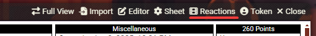
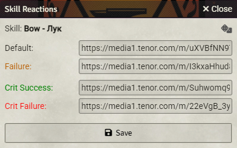
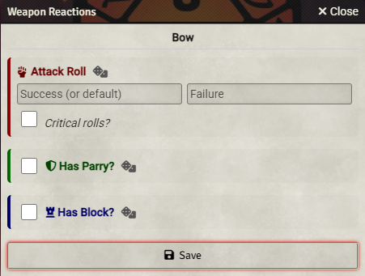
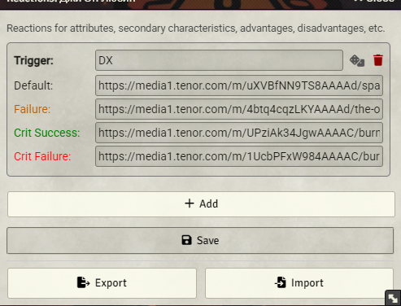
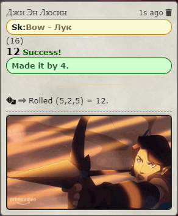
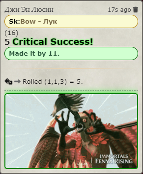

[🇬🇧 English version](README.md)

# GURPS Roll Reactions

Модуль для Foundry VTT (система GURPS), который отображает визуальные реакции — GIF или картинки — в сообщениях чата в зависимости от результата броска.

## Возможности

- **Настройка на каждого персонажа** — у каждого актора свой набор реакций, настраивается из листа персонажа
- **Три типа триггеров:** Навыки, Оружие (атака/парирование/блок), Универсальные (любой текст)
- **Реакции по результату** — отдельные картинки для успеха, провала, критического успеха и критического провала
- **Каскадная логика** — если картинка для результата не задана, используется картинка по умолчанию
- **Тест реакции** — предпросмотр картинки при заданном уровне навыка и броске, без реального броска
- **Импорт / Экспорт** — сохранение всех реакций персонажа в JSON-файл и восстановление или копирование на другого персонажа
- **Управление реакциями** — инструмент GM: просмотр и удаление реакций у персонажей или сброс всех сразу
- **Локализация** — русский и английский

## Использование

### 1. Открыть настройку

Нажми кнопку **Reactions** в заголовке листа персонажа.

### 2. Настроить триггеры

Три вкладки: **Навыки**, **Оружие**, **Универсальные**. Введи название триггера (должно совпадать с текстом в броске) и вставь URL картинок или GIF.

<table>
<tr>
<td> Реакции на навыки</td>
<td> Реакции на оружие (атака/парирование/блок)</td>
<td> Универсальные триггеры</td>
</tr>
</table>

### 3. Результат в чате

После броска подходящая картинка автоматически появляется в сообщении чата.

<table>
<tr>
<td> Обычный результат</td>
<td> Критический результат со свечением</td>
</tr>
</table>

### Импорт / Экспорт реакций

Открой диалог универсальных триггеров для любого персонажа. Внизу диалога две кнопки:

- **Экспорт** — скачивает файл `grr-<ИмяПерсонажа>.json` со всеми реакциями этого персонажа (навыки, оружие и универсальные триггеры)
- **Импорт** — загружает ранее сохранённый JSON-файл и применяет его к текущему персонажу; данные объединяются с уже существующими

Это позволяет делать резервные копии настроек, копировать реакции между персонажами или делиться ими с другими GM.

### GM: Управление реакциями

**Настройки игры → Управление реакциями** — просмотр и удаление реакций по персонажам или сброс всех сразу.

## Настройки

| Настройка | Область | Описание |
|---|---|---|
| Свечение при критических бросках | Для каждого игрока | Включает зелёную/красную рамку при критическом успехе/провале |
| Управление реакциями | Только GM | Просмотр и удаление реакций по персонажам или сброс всех |

## Совместимость

- Foundry VTT: v11–v13
- Система: GURPS (gurps)
